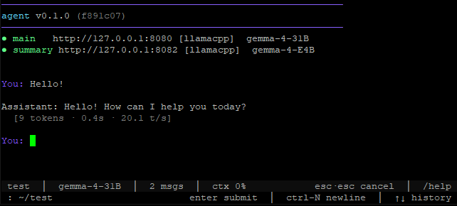

# agent

A local, tool-driven coding assistant that talks to an OpenAI-compatible LLM endpoint (e.g. `llama-server` from `llama.cpp`) and runs an autonomous file/shell tool loop. It is built to survive long sessions: it checkpoints every turn, summarizes older history in the background, recovers from malformed tool calls, and catches common hallucinations before they poison context.



## Quick start

1. Start an OpenAI-compatible LLM server locally. The default endpoint is `http://127.0.0.1:8080`:

   ```bash
   llama-server -m your-model.gguf --port 8080
   ```

2. (Optional) create a `config.json` in your working directory to override defaults — see [Configuration](#configuration).

3. Run the agent:

   ```bash
   python agent.py "fix the failing test in tests/test_parser.py"
   ```

## CLI

```
python agent.py [OPTIONS] [PROMPT...]
```

| Flag | Description |
| --- | --- |
| `-a`, `--auto` | Automation mode — run the prompt and exit; no interactive loop. |
| `-c`, `--continue` | Resume from the last checkpoint and drop into an interactive session. Combine with `-a` for auto-resume-and-exit. |
| `-r N`, `--repeat N` | Run the prompt `N` times with fresh state each run. `0` or omitted means run indefinitely. Implies `-a`. |
| `--nudge` | When the model returns a text-only response (no tool calls), auto-nudge it to keep going instead of stopping. Off by default. |
| `--no-tui` | Disable the `prompt_toolkit` TUI and use a plain `input()` prompt. The TUI is on by default in any interactive mode and falls back to plain input automatically if `prompt_toolkit` isn't installed. |
| `--verbose` | Start the session with full (uncompacted) tool output. Toggle in-session with `/verbose`. |
| `--backend-main` | Override the main backend kind (`llamacpp` or `bedrock`). |
| `--backend-summary` | Override the summary backend kind (`llamacpp` or `bedrock`). |
| `PROMPT...` | Initial prompt. Optional; in interactive mode you'll be prompted if omitted. |

Press **Escape twice** within 400ms to cancel a streaming response. In the TUI this works while the model is streaming; the prompt itself uses `prompt_toolkit`'s native key handling.

### Interactive TUI (default)

When running interactively, the agent uses a `prompt_toolkit` front-end with:

- A **bottom toolbar** showing `cwd · model · message count · context ~% · verbose state`.
- **Completion** for slash commands (`/he<Tab>`) and `@path` file refs (`@src/<Tab>`).
- **Input history** navigable with ↑ / ↓.
- **Key bindings**: `Enter` submits, `Ctrl+N` inserts a literal newline.

Pass `--no-tui` to use the plain `input()` prompt instead. The `prompt_toolkit` package is an optional dependency — if it isn't installed, the agent prints a one-line notice and falls back to the plain prompt automatically.

### Interactive commands

In the interactive loop, lines starting with `/` are commands:

| Command | Description |
| --- | --- |
| `/help` | List available commands. |
| `/clear` | Clear conversation history and start a fresh session log. |
| `/context` | Show current context usage as an Aurora-gradient bar with token counts. |
| `/model` | Pick a different model from the server's `/v1/models` endpoint (summarizer keeps its original). |
| `/verbose` | Toggle compact vs. full tool-result output. Full results are always logged regardless. |
| `/tools [N\|all]` | Show buffered tool calls with a one-line result preview. Default `/tools` shows every call in the rolling buffer (50 most recent); `/tools N` shows the last `N`; `/tools all` is an explicit synonym for the default. |
| `exit` / `quit` | End the session. |

### Colors

The terminal UI uses the **Aurora** palette (violet → sky → mint) via `theme.py`. `NO_COLOR=1` or piping to a file disables all colors and cursor escapes automatically.

## How it works

Each cycle is a turn loop:

1. Build a context window from recent history plus an async summary of older history.
2. Stream a response from the LLM.
3. Execute any tool calls.
4. Feed results back in and repeat until the model stops calling tools, a cycle limit is hit, or the user cancels.

The loop has a few guardrails worth knowing about:

- **Checkpointing.** Conversation history and summary state are written to `.agent/state/conversation_checkpoint.json` every turn. `--continue` resumes from there.
- **Async summarization.** If a summary endpoint is configured, a background thread condenses older messages while the main model keeps working. The summary is swapped in when ready.
- **Cycle limits & wind-down.** After `cycle.max_turns` turns (default 100), the agent is asked to wrap up; after `cycle.wind_down_turns` more turns it is forced to stop.
- **Text-loop detection.** If the model emits the same text three times in a row, the cycle ends instead of looping forever.
- **Hallucination guards.** When the model claims to have read a file it never actually read, the fabricated message is stripped and a correction injected. Malformed tool-call JSON is also salvaged heuristically.
- **Tool recovery.** When a tool fails with a recognizable error (e.g. bad line numbers), `tool_recovery.py` tries to re-run it with corrected parameters via a lightweight LLM call.
- **Context overflow handling.** Three consecutive HTTP 500s from the LLM endpoint are treated as context overflow — the agent trims history and retries.
## Project layout

```
agent.py            # Main loop, streaming, context management, checkpointing
callbacks.py        # UI callback interface — NullCallbacks, TerminalCallbacks, safe_cb
commands.py         # Slash-command dispatcher (/help, /clear, /verbose, /tools, …)
tui.py              # prompt_toolkit front-end (default in interactive mode; --no-tui to disable)
cancel.py           # Double-escape cancel handler
spinner.py          # Aurora-pulsed waiting/streaming/done visual feedback
theme.py            # Aurora color palette + single source of ANSI escapes
token_utils.py      # Tokenizer (Gemma) with char-based fallback
tool_recovery.py    # Auto-recovery from recoverable tool errors
llm_backend.py       # Core abstraction layer for LLM interactions and backend switching
bedrock_api.py      # Implementation of the AWS Bedrock Chat API integration
dev_mode_prompt.py   # Prompt templates and configurations for Bedrock's dev-mode
tools/              # Built-in tools (see below)
  file.py           # read / write / insert / append / delete / list
  exec_command.py   # Shell execution with background-session support
  search_files.py   # Grep-like search with glob and case controls
  read_pdf.py       # PDF text extraction (PyMuPDF)
  web_fetch.py      # URL → markdown, saved to disk with inline preview
  think.py          # Deep-reasoning tool via a separate thinking call
  task_tracker.py   # Persistent task list in .agent/state/tasks.json
  sleep.py          # Pause execution
.agent/             # Runtime artifacts (created on first run, gitignored)
  state/
    conversation_checkpoint.json
    tasks.json
    current-state.json
    cycle.txt
    fetched/        # Cached web_fetch output
  history/
    session-*.log   # Per-session verbose logs
```

Agent-specific tools can also live in `./tools/` alongside your working directory — they are auto-discovered and registered on startup.

## Configuration

Drop a `config.json` in the working directory to override any of the built-in defaults. The top-level sections are:

- **`backends`** — registry with `main` and `summary` entries; each carries a `kind` (`"llamacpp"` or `"bedrock"`) plus kind-specific keys (`base_url`, `model`, … for llamacpp; `api_url`, `api_key`, `model`, `origin`, `poll_*` for bedrock). Preferred shape going forward. See [Bedrock backend](#bedrock-backend) below.
- **`llm`**, **`summary`** — legacy flat blocks (`base_url`, `model`, …). Still supported for back-compat: at load time they are synthesized into `backends.main` / `backends.summary` with `kind: "llamacpp"`. New configs should use `backends`; old configs need no change.
- **`generation`** — `temperature`, `top_p`, `top_k`, `presence_penalty`.
- **`context`** — `ctx_size`, `max_tokens`, `max_full_lines`, `preview_lines`, `summary_threshold`, `summary_max_chars`, `max_context_messages`. Controls how history is sized and when it gets summarized.
- **`cycle`** — `max_turns`, `wind_down_turns`, `max_text_only`. Per-cycle turn budget and text-only nudge cap.
- **`retry`** — `max_retries`, `base_delay_seconds`, `max_delay_seconds`, `backoff_multiplier`, `jitter_factor`. Exponential backoff for transient LLM errors.

Example using the registry shape:

```json
{
  "backends": {
    "main":    { "kind": "llamacpp", "base_url": "http://127.0.0.1:8080", "model": "gemma-4-31B" },
    "summary": { "kind": "llamacpp", "base_url": "http://127.0.0.1:8082", "model": "gemma-4-E4B", "enabled": true, "max_wait_on_save": 10 }
  },
  "context": { "ctx_size": 32768 },
  "cycle":   { "max_turns": 50 }
}
```

Equivalent legacy shape (still works, synthesized into the registry at load time):

```json
{
  "llm":     { "base_url": "http://127.0.0.1:8080", "model": "gemma-4-31B" },
  "summary": { "base_url": "http://127.0.0.1:8082", "model": "gemma-4-E4B", "enabled": true, "max_wait_on_save": 10 },
  "context": { "ctx_size": 32768 },
  "cycle":   { "max_turns": 50 }
}
```

## Bedrock backend

The agent can talk to an AWS Bedrock Chat gateway (aws-samples/bedrock-chat) for either the main model, the summary model, or both. Main-on-bedrock uses prompt stuffing to deliver tool calls (see `plan/bedrock-integration.md` § 8); summary-on-bedrock is a straight one-shot call.

### Credentials

The agent resolves Bedrock credentials in this order at startup:

1. **Keystore** — first `up` entry in `~/.config/agent/bedrock_creds.json` (lowest `daily_spend_usd` wins, oldest `last_checked` breaks ties so stale entries get re-tested first). Override the path via `AGENT_BEDROCK_STORE`.
2. **Env vars** — `BEDROCK_API_URL` + `BEDROCK_API_KEY` (back-compat fallback).
3. Otherwise the agent fails fast.

#### Keystore (recommended)

The keystore lets you register multiple gateway/key pairs and rotate to a sibling when one saturates or 5xx's. The file is created with mode `0o600`, atomic writes, and process-level `flock` so concurrent CLI invocations don't tear the JSON.

Manage it with the `bedrock` subcommand on `agent.py`:

```bash
# add — runs a health probe and stores the result alongside the entry
python agent.py bedrock add --name prod --url "https://<gw>.execute-api.us-east-1.amazonaws.com/prod" --key "<api-key>"

# list — table view (or --json for the raw file)
python agent.py bedrock list

# retest — re-probe one entry or every entry
python agent.py bedrock retest prod
python agent.py bedrock retest --all

# rm — remove by name (--yes skips the prompt)
python agent.py bedrock rm prod

# prune — drop entries that have been down longer than N days (default 30)
python agent.py bedrock prune --stale-days 14
```

`list` columns: `NAME`, `STATUS` (`up` / `down` / `unknown`), `SPEND` (today's `daily_spend_usd`), `LAST_CHECKED`, `LAST_ERROR`. The store auto-rotates from a saturating entry to the next eligible sibling at session start; explicit rotation isn't a CLI verb.

#### Env vars (fallback)

```bash
export BEDROCK_API_URL="https://<your-gateway-id>.execute-api.us-east-1.amazonaws.com/prod"
export BEDROCK_API_KEY="<your-api-gateway-key>"
```

Used only when the keystore has no `up` entries. Useful for CI or one-off runs where you don't want a persistent file.

#### Spend caps

`BEDROCK_DAILY_CAP_USD` caps the combined spend for the day across roles (useful for CI). Default caps are `$10/day` for main and `$1/day` for summary — set either via `backends.<role>.daily_cost_cap_usd` in `config.json`, or override both via the env var. The keystore's per-entry `daily_spend_usd` is separate from these caps and feeds entry selection.

### Config — all four combinations

1. **llamacpp main + llamacpp summary** (today's default — no change):
   ```json
   { "backends": {
       "main":    { "kind": "llamacpp", "base_url": "http://127.0.0.1:8080", "model": "gemma-4-31B" },
       "summary": { "kind": "llamacpp", "base_url": "http://127.0.0.1:8082", "model": "gemma-4-E4B" }
   }}
   ```

2. **llamacpp main + bedrock summary** (canary — cheapest way to try Bedrock):
   ```json
   { "backends": {
       "main":    { "kind": "llamacpp", "base_url": "http://127.0.0.1:8080", "model": "gemma-4-31B" },
       "summary": { "kind": "bedrock",  "model": "claude-v4.5-haiku",
                    "enabled": true, "max_wait_on_save": 30 }
   }}
   ```

3. **bedrock main + llamacpp summary**:
   ```json
   { "backends": {
       "main":    { "kind": "bedrock",  "model": "claude-v4.5-sonnet" },
       "summary": { "kind": "llamacpp", "base_url": "http://127.0.0.1:8082", "model": "gemma-4-E4B" }
   }}
   ```

4. **bedrock everywhere**:
   ```json
   { "backends": {
       "main":    { "kind": "bedrock", "model": "claude-v4.5-sonnet" },
       "summary": { "kind": "bedrock", "model": "claude-v4.5-haiku" }
   }}
   ```

Per-run override: pass `--backend-main bedrock` / `--backend-summary bedrock` on the CLI to flip the kind for a single invocation without editing `config.json`.

### Security

- The keystore at `~/.config/agent/bedrock_creds.json` is forced to mode `0o600` on every write (atomic `tempfile + os.replace`, `0o600` set on the temp fd so there's no widened-mode window).
- `config.json` should be `chmod 600` if you put a non-empty `api_key` in it directly. At startup the agent logs a WARN if the file is world-readable.
- The daily spend counter at `CICD/bedrock_spend.json` is written with mode `0o600` (no secrets, usage data only — but the mode is locked regardless).
- `BEDROCK_API_KEY` and stored entry keys are redacted at every `_config` log site (no sentinel-value leak — covered by `tests/test_bedrock_security.py`).

### Known limitations

- **Dev-mode prompt overhead.** Bedrock has no native tool-calling in the gateway; tools are serialized into the prompt text (~1.5-2k tokens per turn with the agent's ~10-tool set). Accepted trade-off for Phase 2; see `plan/bedrock-integration.md` § 8.4 / K12.
- **Gemma tokenizer approximation.** Token counts for non-llamacpp backends use the same Gemma-3 tokenizer and systematically overshoot Claude text by ~10-20% (safe direction — errs toward reserving more context).
- **No progressive streaming.** The gateway doesn't expose in-progress message text, so Bedrock turns deliver a single content delta at the end rather than incremental tokens. See § 7.3 Option A.

See `plan/bedrock-integration.md` § 8 for the dev-mode prompt-stuffing details and § 18.5 for the operator runbook (5xx bursts, truncation exhaustion, key rotation, cost spikes, rollback).

## Dependencies

- Python 3.7+
- `requests` — HTTP to the LLM endpoint
- `transformers` + `torch` — Gemma tokenizer (optional; falls back to a character-based estimate if missing)
- `PyMuPDF` (`fitz`) — PDF extraction, used by `tools/read_pdf.py`
- `markdownify` — HTML → Markdown conversion, used by `tools/web_fetch.py`
- `prompt_toolkit` — powers the default interactive TUI (bottom toolbar, completion, input history). Technically **optional** — if it isn't installed, interactive mode automatically falls back to a plain `input()` prompt and prints a one-line notice. Pass `--no-tui` to force the plain prompt even when `prompt_toolkit` is available. Install with `pip install prompt_toolkit`.
- A running OpenAI-compatible LLM server (e.g. `llama-server`)
- Bash, and a TTY for the cancel handler

## State and logs

Everything runtime lives under `.agent/` in the working directory:

- `.agent/state/conversation_checkpoint.json` — last checkpoint for `--continue`
- `.agent/state/tasks.json` — persistent task list used by the `task_tracker` tool
- `.agent/state/current-state.json` — per-cycle scratch state
- `.agent/state/cycle.txt` — monotonic cycle counter
- `.agent/state/fetched/` — cached `web_fetch` downloads
- `.agent/history/session-*.log` — verbose per-session logs

Delete the `.agent/` directory to start completely fresh. The whole tree is gitignored.
