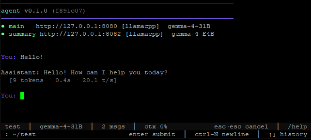

# agent

A local, tool-driven coding assistant that talks to an OpenAI-compatible LLM endpoint (e.g. `llama-server` from `llama.cpp`) and runs an autonomous file/shell tool loop. Built to survive long sessions: checkpoints every turn, summarizes older history in the background, recovers from malformed tool calls, and catches common hallucinations before they poison context.



📖 **[Documentation site](https://mblakemore.github.io/agent/)** — this README and the `docs/` guides, rendered.

## Install

`pip install --user -r requirements.txt`, or into a venv. Windows runs via Git-Bash rather than
`cmd`/PowerShell. Full instructions, PEP 668 notes and Git-Bash resolution order:
**[docs/install.md](docs/install.md)**.

## Quick start

1. Start an OpenAI-compatible LLM server locally (default endpoint `http://127.0.0.1:8080`):
   ```bash
   llama-server -m your-model.gguf --port 8080
   ```
2. Run interactively in a fresh folder — the **first-run setup wizard** launches
   automatically, scans localhost for your running servers, and configures +
   calibrates everything (see [Setup wizard](#setup-wizard--setup)):
   ```bash
   python agent.py
   ```
   Or skip the wizard and go straight to a task (a hand-written `config.json`
   also works — see [Configuration](#configuration)):
   ```bash
   python agent.py "fix the failing test in tests/test_parser.py"
   ```

**Recommended models:** the current recommendation is **Qwen3.8** for the main driver, a small
model on CPU for summarisation, and optionally **GLM-5.2** on CPU as a consulted advisor tier.
Fine-tuned variants of the Qwen3.6 and Gemma 4 lines are published too.

See **[docs/models.md](docs/models.md)** for the full list and what to pick, **[docs/setup.md](docs/setup.md)**
for download/quantize/serve instructions, and **[docs/configurations.md](docs/configurations.md)**
for the `config.json` shapes that combine them.

## Setup wizard — `/setup`

Running `agent.py` interactively in a folder with no config (no `.agent/config.json`,
no legacy `config.json`) launches a **first-run wizard** before the first prompt —
real-TTY sessions only; `-a`/piped/scripted runs never block on it. The same wizard is
available any time as `/setup`.

It opens with a short intro (the rolling-window model, the three roles), then offers
to **scan localhost for running model servers** — llama-server's 8080–8086,
`glm serve` :8000/:8001, :5000, ollama :11434. Hits show their model name and context
size and become numbered menu options, so a multi-endpoint setup is a few keystrokes:

```
found 2 server(s):
   • http://127.0.0.1:8080  Qwen3.8-27B-GGUF, ctx 196,608
   • http://127.0.0.1:8082  Qwen3-4B-GGUF:Q8_0, ctx 40,960
```

Each role — **main**, **summary**, **advisor** — is configured against `llamacpp`
(any OpenAI-compatible endpoint), `bedrock`, or `foundry` (Azure), then **probed
live**: reachability, auth (a 401 is kept distinct from unreachable), model resolve
(auto-picks from `/v1/models`), **max context** (`/props` → `/slots` → model
metadata → an empirical binary search that trusts the server's own token counts,
consent-gated with a cost estimate on metered backends), throughput, and capability
flags (tool-call roundtrip, reasoning parameter, server timings). A probe that
cannot run reports `UNMEASURED` — never conflated with `FAILED`.

**Calibration** derives the engine's context budget from what was actually measured
— `ctx_size` (measured − 10%), summary threshold, message caps — and records the
derivation in a `_calibrated` sidecar so later runs can report **drift**. Nothing
unmeasured is ever written: shipped defaults stay, and the wizard says so.

The wizard also asks about the **claim guard** — the end-of-response check that
blocks a "verified/committed" claim with no matching tool call. It's **off by
default** (story prose can false-positive as a claim); enable it for coding
projects.

Forms: `/setup` (full run) · `/setup main|summary|advisor` (one section) ·
`/setup test` (probe everything, change nothing, spend nothing) ·
`/setup calibrate` (re-derive + drift report). Config lands in
`.agent/config.json` (chmod 600 when a key is present); inside a git repo the
engine auto-gitignores `.agent/` + `config.json` and **warns loudly if a config
file is already tracked** — gitignore doesn't untrack, and the warning includes
the exact `git rm --cached` fix.

## Agent scaffold — `/agent`

`/agent` mints an autonomous-agent identity in the current folder — an instructions
file the agent *is*, plus its state tree. A full `/setup` run offers to chain
straight into it at the end.

- **Type first, then name**: `six-phase` (the full agent — identity, patterns,
  anchors, creator messages, verification gate), `worker` (4-phase task agent
  with a decisions log), or `minimal` (bare loop). The name defaults to the
  folder's.
- The generated `AGENT.md`/`CLAUDE.md` carries a first-person identity, a
  wrong-repo guard (`git remote -v`, stop if it isn't yours), one-cycle-per-
  invocation discipline, a verify-before-decide gate — and, generated from your
  **live config**, a "My Models" table with the real endpoints and model names,
  advisor escalation guidance only when an advisor is actually configured, and the
  measured context window. No config → it points at `/setup`; nothing is invented.
- **An agent requires a git repo** (the commit is its continuity). In a bare
  folder the wizard offers: local `git init` · create a GitHub repo via an
  authenticated `gh` CLI and wire it as `origin` · or stop cleanly so you can
  clone a blank repo yourself first. Setup finalizes with an init commit
  (`C0: <name> scaffolded — awakening pending`) of exactly the scaffolded files —
  runtime state and logs stay untracked — and pushes when an origin exists.

Both identity filenames load whole when referenced (`@AGENT.md` / `@CLAUDE.md`):
start the agent with `@AGENT.md run the loop`.

## CLI

Arguments, flags, the Claude Code gateway (`-cc`), the interactive TUI, slash commands and
environment variables: **[docs/cli.md](docs/cli.md)**.

## How it works

Each cycle is a turn loop:

1. Build a context window from recent history plus an async summary of older history.
2. Stream a response from the LLM.
3. Execute any tool calls.
4. Feed results back in and repeat until the model stops calling tools, a turn limit is hit, or the user cancels.

Guardrails:

- **Checkpointing** — history and summary state are written to `.agent/state/conversation_checkpoint.json` every turn. `--continue` resumes from there.
- **Async summarization** — a background thread condenses older messages while the main model keeps working.
- **Cycle limits** — after `cycle.max_turns` turns (default 100) the agent is asked to wrap up; after `cycle.wind_down_turns` more it is forced to stop.
- **Text-loop detection** — three identical text responses in a row ends the cycle.
- **Hallucination guards** — fabricated file-read messages are stripped and a correction injected. Malformed tool-call JSON is salvaged heuristically.
- **Tool recovery** — recoverable tool errors (e.g. bad line numbers) are retried with corrected parameters via a lightweight LLM call.
- **Context overflow handling** — three consecutive HTTP 500s are treated as context overflow; the agent trims history and retries.

### Escalation — when the advisor is consulted

When an `advisor` endpoint is configured, three signals can route to it, all through one policy:

- **gate** — the success check has blocked repeatedly: the model declared itself done while it was
  wrong. This *suggests* escalation.
- **stall** — the model repeated a failing action *and* ignored a prior redirect. Auto-invokes.
- **grind** — most of the turn budget is spent and the success check is still failing: distinct
  plausible actions until wall-clock, without converging. Auto-invokes.

`stall` and `grind` are the cases where a stuck model never cleanly declares done, so the gate never
sees them. Escalation is deliberately biased toward *not* firing — a false escalation spends minutes
of a slow model's latency for nothing — and is capped by `max_calls_per_task`.

Two modes exist: **advisor** (default) is one bounded question and one answer, with the fast model
keeping the loop; **takeover**, where the advisor drives a sub-loop, is reserved for a narrow class
the fast model has repeatedly failed, because every turn of it pays the slow model's latency.

## Project layout

```
agent.py            # Main loop, streaming, context management, checkpointing
callbacks.py        # UI callback interface
commands.py         # Slash-command dispatcher
tui.py              # prompt_toolkit front-end
cancel.py           # Double-escape cancel handler
spinner.py          # Aurora-pulsed visual feedback
theme.py            # Aurora color palette + ANSI escapes
token_utils.py      # Tokenizer (Gemma) with char-based fallback
tool_recovery.py    # Auto-recovery from recoverable tool errors
llm_backend.py      # LLM backend abstraction (llamacpp, bedrock)
bedrock_api.py      # AWS Bedrock Chat API integration
cc_gateway.py       # Anthropic /v1/messages gateway for Claude Code (agent.py -cc)
tools/
  file.py           # read / write / insert / append / delete / list
  exec_command.py   # Shell execution with background-session support
  search_files.py   # Grep-like search with glob and case controls
  read_pdf.py       # PDF text extraction (PyMuPDF)
  web_fetch.py      # URL → markdown, saved to disk with inline preview
  think.py          # Deep-reasoning tool via a separate thinking call
  task_tracker.py   # Persistent task list in .agent/state/tasks.json
  sleep.py          # Pause execution
.agent/             # Runtime artifacts (created on first run, gitignored)
  state/            # Checkpoint, tasks, cycle counter, web_fetch cache
  history/          # Per-session verbose logs
```

Agent-specific tools in `./tools/` alongside your working directory are auto-discovered and registered on startup.

## Configuration

Drop a `config.json` in the working directory (i.e. wherever you run `agent.py` from) to override defaults. All sections are optional; omitted keys use the defaults listed below. **You rarely need to write this by hand** — the [`/setup` wizard](#setup-wizard--setup) writes and calibrates it for you from live probes of your endpoints.

The agent looks for `.agent/config.json` first, then falls back to `config.json` in the working directory. Putting it under `.agent/` keeps your local, key-bearing config alongside the other runtime files. When you run inside a git repo, the agent best-effort adds `.agent/` and `config.json` to `.gitignore` so your config (which may hold API keys) and runtime state never get committed. Outside a repo it leaves the directory untouched.

### `backends`

Preferred shape. Replaces the legacy `llm` / `summary` flat blocks (which still work — they are synthesized into `backends` at load time).

```json
{
  "backends": {
    "main": {
      "kind":     "llamacpp",
      "base_url": "http://127.0.0.1:8080",
      "model":    "my-model-name",
      "api_key":  "",
      "stream":   true
    },
    "summary": {
      "kind":     "llamacpp",
      "base_url": "http://127.0.0.1:8082",
      "model":    "my-summary-model",
      "enabled":  true
    }
  }
}
```

| Key | Default | Description |
| --- | --- | --- |
| `kind` | `"llamacpp"` | Backend type: `"llamacpp"`, `"bedrock"`, or `"foundry"`. |
| `base_url` | `"http://127.0.0.1:8080"` | OpenAI-compatible endpoint. |
| `model` | `"gemma-4-31B"` | Model name passed to the endpoint (informational for llamacpp; selects the Bedrock model ID for bedrock). |
| `api_key` | `""` | Bearer token sent as `Authorization: Bearer <key>`. Keep this file `chmod 600`. |
| `stream` | `true` | Set `false` to use non-streaming completions (useful for debugging). |
| `enabled` | `true` (main) / `true` (summary) | Set `false` to disable the summary backend entirely. |

For **Bedrock**-specific keys (`api_url`, spend caps, keystore) see [docs/bedrock.md](docs/bedrock.md).

### `generation`

Inference parameters forwarded to the LLM on every request.

| Key | Default | Description |
| --- | --- | --- |
| `temperature` | `0.6` | Sampling temperature. |
| `top_p` | `0.95` | Nucleus sampling threshold. |
| `top_k` | `20` | Top-K sampling. |
| `min_p` | `0.0` | Min-P sampling (0 = disabled). |
| `presence_penalty` | `0.0` | Penalise tokens already present in context. |
| `enable_thinking` | `false` | Whether the **main loop** may emit thinking. Default `false`: the design is no-thinking-in-main plus the opt-in [`think` tool](#think), so the model reasons hard only when it chooses to. Set `true` to let the main model think on every turn (bounded by `max_tokens`; the `think` tool stays available either way). On tasks a capable model handles, `true` is measurably slower (~2–6×) for no accuracy gain — reach for it on genuinely hard tasks, not as a default. Requires a thinking-capable model/server (e.g. Qwen3 with `llama-server --reasoning`). |

### `think`

Budgets for the opt-in `think` tool — a separate deep-reasoning call the model can invoke on demand. Independent of `generation.enable_thinking` above: the tool is always available regardless of that flag.

| Key | Default | Description |
| --- | --- | --- |
| `depths.brief` | `2048` | `max_tokens` for a `brief` think — the default depth, sufficient for most decisions. |
| `depths.normal` | `4096` | `max_tokens` for a `normal` think — complex multi-step reasoning. |
| `depths.deep` | `16384` | `max_tokens` for a `deep` think — rarely needed. |

The three preset **names** (`brief`/`normal`/`deep`) are fixed; only their token values are tunable — a fast small model may want smaller ceilings, a slow reasoning model larger. A malformed or non-positive override for any preset is ignored, keeping that preset's built-in default (a bad config can never zero out a budget).

### `context`

Controls context-window sizing and compaction.

| Key | Default | Description |
| --- | --- | --- |
| `ctx_size` | `114688` | Context window size in tokens. Auto-detected from the server's `/props` endpoint when available; this value is the fallback cap. |
| `max_tokens` | `16384` | Maximum tokens in a single completion. |
| `max_full_lines` | `800` | Lines of tool output kept verbatim before compaction. |
| `preview_lines` | `200` | Lines shown in the compacted preview. |
| `summary_threshold` | `5` | Messages beyond which background summarisation fires. |
| `summary_max_chars` | `3000` | Maximum characters in a generated summary chunk. |
| `max_context_messages` | `30` | Hard cap on messages sent to the LLM per turn. |

### `cycle`

Per-session run limits.

| Key | Default | Description |
| --- | --- | --- |
| `max_turns` | `250` | Stop (or wind down) after this many turns. |
| `wind_down_turns` | `10` | Turns of grace period after `max_turns` before a hard stop. |
| `max_text_only` | `3` | Consecutive text-only responses that trigger a halt (loop detection). |
| `max_total_nudges` | `6` | Total auto-nudges allowed before giving up (requires `preferences.nudge` or `--nudge`). |

### `retry`

Exponential-backoff settings for failed LLM requests.

| Key | Default | Description |
| --- | --- | --- |
| `max_retries` | `10` | Maximum retry attempts before the request fails. |
| `base_delay_seconds` | `2` | Initial retry wait. |
| `max_delay_seconds` | `60` | Cap on retry wait. |
| `backoff_multiplier` | `2.0` | Multiplier applied to delay each retry. |
| `jitter_factor` | `0.1` | Random jitter added to each delay (fraction of current delay). |

### `advisor`

An optional third role alongside `main` and `summary`: a **heavyweight model consulted as a tool**,
never as the driver. A very large model on CPU can be far too slow to run a loop and still be the
best thing available for the rare hard sub-problem, so the fast model keeps the loop and calls
`consult_advisor` when it is stuck.

`advisor` is a **top-level block**, not one of `backends`. The tier is off unless you configure it.

```json
{
  "advisor": {
    "enabled":              true,
    "base_url":             "http://127.0.0.1:8000",
    "model":                "glm-5.2",
    "prefill_token_budget": 1500,
    "max_tokens":           512,
    "max_calls_per_task":   3,
    "timeout_s":            900
  }
}
```

| Key | Default | Description |
| --- | --- | --- |
| `enabled` | true when `base_url` is set | Tier is off unless an endpoint is configured. |
| `base_url` | — | OpenAI-compatible endpoint for the advisor model. |
| `model` | — | Model name passed to that endpoint. |
| `api_key` | `""` | Bearer token, if the endpoint needs one. |
| `prefill_token_budget` | `1500` | Hard ceiling on the brief handed to the advisor (see below). |
| `max_tokens` | `512` | Cap on the advisor's answer. |
| `max_calls_per_task` | `3` | Consultations per task, so a stuck loop cannot spend the session waiting. |
| `timeout_s` | `900` | Per-consultation timeout. |

**It distills before it asks.** A slow model's prefill dominates: feeding a multi-thousand-token
transcript to a ~3 pos/s prefill costs many minutes before it emits a word. So the caller's context
is compressed on the fast **summary** model down to `prefill_token_budget` first — the advisor reads
the brief, not the transcript. If distillation cannot get under budget, the escalation does **not**
happen silently.

**It fails open.** Any endpoint error, timeout, or disabled config returns a plain notice and the
driver proceeds *without* the advice. An escalation tool must never block the loop it exists to help.

**It is probed at startup.** If the endpoint is unreachable, `consult_advisor` is removed from the
tool registry, so the model never sees a tool it cannot use and never wastes turns escalating to a
server that is not running.

See [docs/configurations.md](docs/configurations.md) for the full three-tier setup, and
[docs/models.md](docs/models.md) for what to run as the advisor.

### `bedrock`

Bedrock-specific tuning (only relevant when `backends.main.kind` or `backends.summary.kind` is `"bedrock"`).

| Key | Default | Description |
| --- | --- | --- |
| `adaptive_max_tokens` | `true` | Dynamically adjust `max_tokens` per request based on detected prompt complexity, staying within the model's limit. |

### `preferences`

Behavioural knobs that don't fit elsewhere.

| Key | Default | Description |
| --- | --- | --- |
| `nudge` | `false` | Auto-nudge the model when it returns a text-only response. Also settable with `--nudge` CLI flag. |
| `persist_nudge` | `false` | After a text-only stop, check `git status`; if uncommitted changes exist and no commit happened this session, inject one nudge to commit. Intended for git-native agents. |
| `tool_selection_hints` | `false` | Prepend a system-prompt directive recommending `file(action='edit')` over heredoc rewrites for existing-file edits. |
| `max_text_response_chars` | `24000` | Cap on text-only response length per turn (characters). Only enforced when `nudge` is on. Prevents context-filling monologue spirals. |
| `max_post_tool_text_chars` | `2000` | Cap on prose generated after tool calls in the same turn. |
| `extra_allowed_paths` | `[]` | List of absolute directory paths the `file` tool is allowed to read/write outside the working directory. |
| `tools_whitelist` | `null` | Restrict the tool schema sent to the LLM to this list of tool names. `null` = all tools. Example: `["file", "exec_command", "search_files", "think", "task_tracker"]`. |
| `initial_tasks` | `[]` | Task descriptions pre-seeded into `task_tracker` at session start (only when the task list is empty — does not overwrite an in-progress cycle). |
| `seed_tasks_persistent` | `false` | Re-seed `initial_tasks` at the start of every cycle, not just on a fresh task list. |

### `command_guards`

A list of regex-pattern / message pairs that intercept `exec_command` calls before the shell sees them. When a command matches a pattern, execution is blocked and the message is returned to the agent as a tool error — the agent can then reason about it and try something else.

Patterns are case-insensitive regexes matched against the full command string.

```json
{
  "command_guards": [
    {
      "pattern": "\\b8080\\b",
      "message": "BLOCKED: Port 8080 is used by the llama.cpp main inference server. Do not start processes on it or kill processes using it. Use a different port (e.g. 8765) for http.server."
    },
    {
      "pattern": "\\b8082\\b",
      "message": "BLOCKED: Port 8082 is used by the llama.cpp summary inference server. Do not use it."
    },
    {
      "pattern": "rm\\s+-rf\\s+/",
      "message": "BLOCKED: Refusing to run recursive delete from filesystem root."
    }
  ]
}
```

Guards fire after the built-in hallucination guards (`/home/user`, `python`→`python3`) but before the command runs.

### Full example

```json
{
  "backends": {
    "main":    { "kind": "llamacpp", "base_url": "http://127.0.0.1:8080" },
    "summary": { "kind": "llamacpp", "base_url": "http://127.0.0.1:8082", "enabled": true }
  },
  "generation": { "temperature": 0.8, "enable_thinking": false },
  "think":      { "depths": { "brief": 2048, "normal": 4096, "deep": 16384 } },
  "context":    { "ctx_size": 32768 },
  "cycle":      { "max_turns": 50 },
  "preferences": {
    "nudge": true,
    "tools_whitelist": ["file", "exec_command", "search_files", "think", "task_tracker"]
  },
  "command_guards": [
    {
      "pattern": "\\b8080\\b",
      "message": "BLOCKED: Port 8080 is reserved for the llama.cpp server."
    }
  ]
}
```

## Bedrock backend

The agent supports AWS Bedrock Chat gateway for either the main or summary model. See [docs/bedrock.md](docs/bedrock.md) for credentials, keystore management, spend caps, config examples, and known limitations.

## Dependencies

- Python 3.7+
- `requests` — HTTP to the LLM endpoint
- `transformers` + `torch` — Gemma tokenizer (optional; falls back to char-based estimate)
- `PyMuPDF` (`fitz`) — PDF extraction (`tools/read_pdf.py`)
- `markdownify` — HTML → Markdown (`tools/web_fetch.py`)
- `prompt_toolkit` — interactive TUI (optional; falls back to plain `input()` automatically)
- A running OpenAI-compatible LLM server
